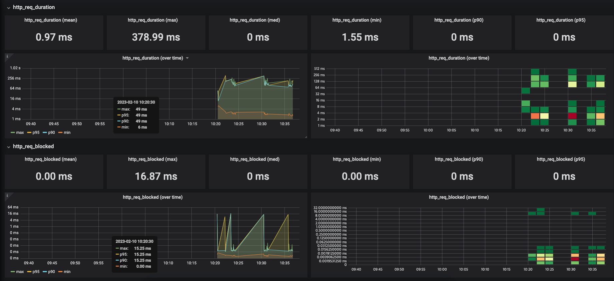
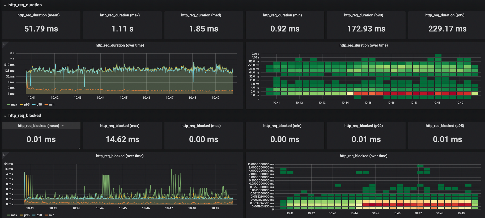
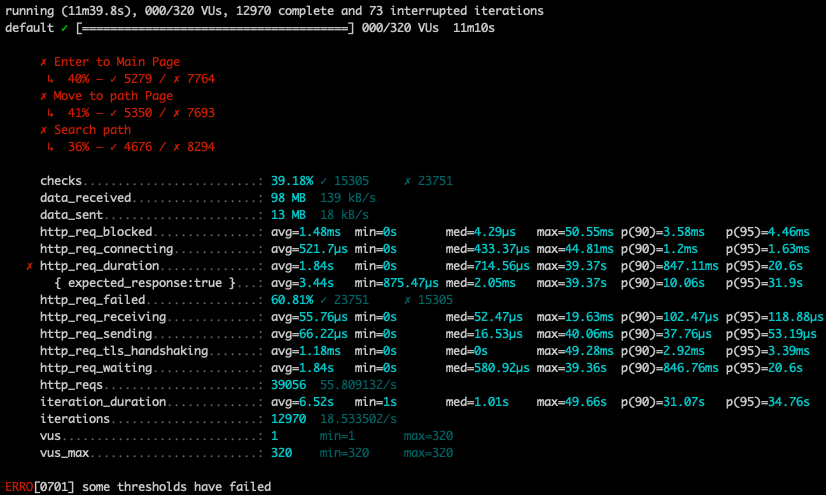

<p align="center">
    
</p>
<p align="center">
  
  
  <a href="https://edu.nextstep.camp/c/R89PYi5H" alt="nextstep atdd">
    
  </a>
  
</p>

<br>

# 인프라공방 샘플 서비스 - 지하철 노선도

<br>

## 🚀 Getting Started

### Install
#### npm 설치
```
cd frontend
npm install
```
> `frontend` 디렉토리에서 수행해야 합니다.

### Usage
#### webpack server 구동
```
npm run dev
```
#### application 구동
```
./gradlew clean build
```
<br>


### 1단계 - 웹 성능 테스트
1. 웹 성능예산은 어느정도가 적당하다고 생각하시나요   

| 측정항목 | my subway | 서울교통공사 | 네이버지도 | 카카오맵  |
|------|-----------|--------|-------|-------|
| FCP  | 2.7       | 1.8    | 0.6   | 0.5   |
| SI   | 2.7       | 7.7    | 2.7   | 2.3   |
| LCP  | 2.8       | 4.3    | 2.5   | 1.4   |
| TTI  | 2.8       | 2.1    | 1.6   | 0.7   |
| TBT  | 50        | 60     | 80    | 0     |
| CLS  | 0.004     | 0.229  | 0.004 | 0.039 |

FCP, TTI 지표가 타 경쟁사 서비스에 비해 높습니다. 지하철 노선 서비스인 만큼 이동중에 사용하는 사용자가 많을것이라 예상되어
두가지 지표를 낮게 만드는것을 목표로 잡았습니다.
타 서비스와 20%의 속도차이가 날 경우 사용자들이 체감할 수 있으니 가장 좋은 지표를 가진 경쟁사와 20% 이내로 차이가 나도록 조절해야할것 같습니다.

| 측정항목 | 목표 |
|--------|-----|
| FCP | 0.6 |
| SI | 2.7 |
| LCP | 1.6 |
| TTI | 0.8 |
| TBT | 50 |
| CLS | 0.004 |


2. 웹 성능예산을 바탕으로 현재 지하철 노선도 서비스의 서버 목표 응답시간 가설을 세워보세요.
- 역 관리 api의 응답시간이 400ms정도 지연되는 걸로 확인됩니다. 이 부분을 개선해야할것 같습니다. 다른 요청들은 100ms 이하로 문제없다고 생각됩니다.

---

### 2단계 - 부하 테스트 
1. 부하테스트 전제조건은 어느정도로 설정하셨나요
###  대상 시스템 범위, 시나리오
- WebServer
- WAS
- DB 

- 데이터를 조회하는데 여러 데이터를 참조하는 페이지
- 홈페이지 접속 -> 경로 검색

### 목표값 설정
- 예상 DAU
  - 하루 평균 지하철 이용자수 약 500만, 이 중 10%가 서비스를 이용한다고 가정
  - DAU : 50만
- 피크시간대 집중률
  - 1명당 1일 평균 접속수 = 2 (출근, 퇴근)
  - 1일 총 접속수 : 50만 * 2 = 100만
  - 1일 평균 rps = 100만 / 86400 = 12
  - 1일 최대 rps = 11.5 * 2.5 = 29(피크타임 집중률 2.5배로 가정)

### VUser
- R : 4 (홈페이지 접속 -> 경로 검색 * 2)
- http_req_duration : 200ms
- T = (4 * 0.2 + 1) -> 1.8
- 평균 VUser = 12(rps) * 1.8(T) / 4(R) = 5
- 최대 VUser = 29(rps) * 1.8(T) / 4(R) = 13


3. Smoke, Load, Stress 테스트 스크립트와 결과를 공유해주세요

### smoke
```javascript
"smoke.js" 42L, 879B                                                                                                                                                                                                                                          6,15          All
import http from 'k6/http';
import { check, group, sleep, fail } from 'k6';

export let options = {
  vus: 1, 
  duration: '60s',

  thresholds: {
    http_req_duration: ['p(99)<200'],
  },
};

const BASE_URL = 'https://uj-subway-infra.n-e.kr';

function main() {
  let mainPageRes = http.get(`${BASE_URL}`);
  check(mainPageRes, {
    'Enter to Main Page' : (res) => res.status === 200,
  });
}

function path() {
  let pathPageRes = http.get(`${BASE_URL}/path`);
  check(pathPageRes, {
    'Move to path Page' : (res) => res.status === 200,
  });
}

function search() {
  let pathSearchRes = http.get(`${BASE_URL}/paths?source=1&target=2`);
  check(pathSearchRes, {
    'Search path' : (res) => res.status === 200,
  });
}

export default function ()  {
  main();
  path();
  search();

  sleep(1);
};
```



### load

```javascript
import http from 'k6/http';
import { check, group, sleep, fail } from 'k6';

export let options = {
  stages: [
        {duration: '20s', target: 5},
        {duration: '3m', target: 5},
        {duration: '20s', target: 13},
        {duration: '5m', target: 13},
        {duration: '20s', target: 0}
  ],
  thresholds: {
    http_req_duration: ['p(99)<200'],
  },
};

const BASE_URL = 'https://uj-subway-infra.n-e.kr';

function main() {
  let mainPageRes = http.get(`${BASE_URL}`);
  check(mainPageRes, {
    'Enter to Main Page' : (res) => res.status === 200,
  });
}

function path() {
  let pathPageRes = http.get(`${BASE_URL}/path`);
  check(pathPageRes, {
    'Move to path Page' : (res) => res.status === 200,
  });
}

function search() {
  let pathSearchRes = http.get(`${BASE_URL}/paths?source=1&target=2`);
  check(pathSearchRes, {
    'Search path' : (res) => res.status === 200,
  });
}

export default function ()  {
  main();
  path();
  search();

  sleep(1);
};
```




### stress

```javascript
import http from 'k6/http';
import { check, group, sleep, fail } from 'k6';

export let options = {
  stages: [
        {duration: '10s', target: 20},
        {duration: '2m', target: 20},
        {duration: '10s', target: 40},
        {duration: '2m', target: 40},
        {duration: '10s', target: 80},
        {duration: '2m', target: 80},
        {duration: '10s', target: 160},
        {duration: '2m', target: 160},
        {duration: '10s', target: 320},
        {duration: '2m', target: 320},
        {duration: '20s', target: 0}
  ],
  thresholds: {
    http_req_duration: ['p(99)<200'],
  },
};

const BASE_URL = 'https://uj-subway-infra.n-e.kr';

function main() {
  let mainPageRes = http.get(`${BASE_URL}`);
  check(mainPageRes, {
    'Enter to Main Page' : (res) => res.status === 200,
  });
}

function path() {
  let pathPageRes = http.get(`${BASE_URL}/path`);
  check(pathPageRes, {
    'Move to path Page' : (res) => res.status === 200,
  });
}

function search() {
  let pathSearchRes = http.get(`${BASE_URL}/paths?source=1&target=2`);
  check(pathSearchRes, {
    'Search path' : (res) => res.status === 200,
  });
}

export default function ()  {
  main();
  path();
  search();

  sleep(1);
};
```




---

### 3단계 - 로깅, 모니터링
1. 각 서버내 로깅 경로를 알려주세요

2. Cloudwatch 대시보드 URL을 알려주세요
