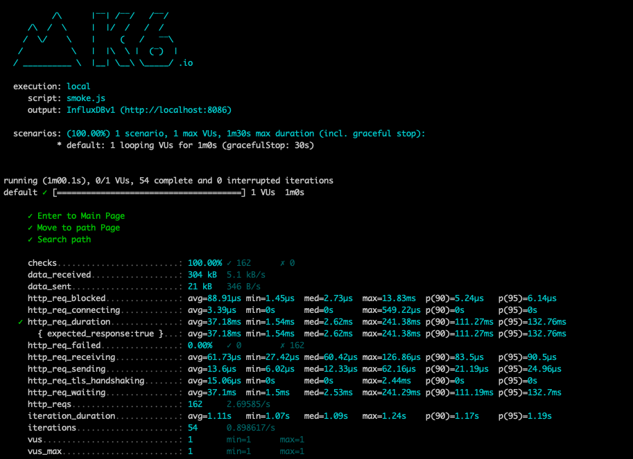
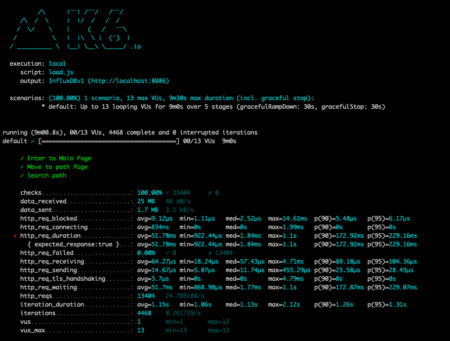

<p align="center">
    
</p>
<p align="center">
  
  
  <a href="https://edu.nextstep.camp/c/R89PYi5H" alt="nextstep atdd">
    
  </a>
  
</p>

<br>

# 인프라공방 샘플 서비스 - 지하철 노선도

<br>

## 🚀 Getting Started

### Install
#### npm 설치
```
cd frontend
npm install
```
> `frontend` 디렉토리에서 수행해야 합니다.

### Usage
#### webpack server 구동
```
npm run dev
```
#### application 구동
```
./gradlew clean build
```
<br>


### 1단계 - 웹 성능 테스트
1. 웹 성능예산은 어느정도가 적당하다고 생각하시나요
- 정량 기반 지표
    - 이미지 파일 최대 크기 : 2MB (https://designlog.org/2512906 참고)
    - 자바 스크립트 파일 크기 합 : 2 MB
- 시간 기반 지표
    - FCP : 1초미만
    - TTI or LCP : 3초 미만 (by 3초의 법칙)
- 규칙 기반 지표
    - pagespeed 측정 데스크톱 기준 평균 80점 이상
- 유사 서비스 성능 기반 지표
    - 서울교통공사
        - 메인 페이지 응답 시간 : 6.3 s(FCP), 8.4 s(TTI)
        - 서비스 응답 시간 (부천 -> 강남 경로 검색 :/kr/getRoute/SearchResult.do) : 427 ms
    - 네이버지도
        - 메인 페이지 응답 시간 : 2.4 s(FCP), 6.2 s(TTI)
        - 서비스 응답 시간 (부천 -> 강남 경로 검색 :/subway/subwayPath.naver) : 439 ms
    - 카카오맵
        - 메인 페이지 응답 시간 : 1.7 s(FCP), 4.9 s(TTI)
        - 서비스 응답 시간 (부천 -> 강남 경로 검색 :/actions/publicRoute) : 1350 ms


2. 웹 성능예산을 바탕으로 현재 지하철 노선도 서비스의 서버 목표 응답시간 가설을 세워보세요.

- 유사 서비스의 메인 페이지의 응답 시간은 1~6 초 사이에 이루어지고 있다.
이 결과와 3초의 법칙을 근거로, 지하철 노선도 서비스의 메인 페이지의 응답 시간은 3초 이내가 되는 것을 목표로 한다.

- 유사 서비스의 경로 탐색 응답 시간은 평균 0.5 초 내에 이루어진다. 
(단, 카카오맵 서비스의 경우 가능한 모든 경로를 탐색하는 더 확장된 기능을 제공하기에 응답 시간이 길게 측정 되었다고 판단한다.)
이 측정 결과의 20 % 를 초과하지 않는 0.6 초 미만을 지하철 노선도 서비스의 경로 탐색 응답 시간 목표로 한다.

---

### 2단계 - 부하 테스트 
1. 부하테스트 전제조건은 어느정도로 설정하셨나요

- 대상 시스템 범위
    - 접속 빈도가 높은 기능
        - 메인 페이지
        - 로그인 및 마이 페이지
- 목푯값 설정 (latency, throughput, 부하 유지기간)
    - latency : http_req_duration 기준 3초 미만
    - throughput : 10.5/105 (평균/최대 rps)
    - 부하 유지 기간 : 30분
- 부하 테스트 시 저장될 데이터 건수 및 크기
    - X

참고 데이터
- 하루 평균 지하철 이용 인원 : 450만 (https://www.bigdata-map.kr/datastory/traffic/seoul)
- 네이버 지도 MAU : 1,400만(DAU 기준 약 45만) (https://blog.naver.com/rkwkrhspm/222515422896)
- 카카오 지하철 MAU : 150만 (https://ko.lab.appa.pe/2016-09/kakao-korea.html)
- 카카오 지하철 일 평균 실행 수 : 2회 (https://ko.lab.appa.pe/2016-09/kakao-korea.html)
- 목표 1일 총 접속 수 = 1일 사용자 수 (DAU) * 1명당 1일 평균 접속 수
    - 90만 = 45만 * 2회
- 목표 1일 평균 rps = 1일 총 접속 수 / 86400(초/일)
    - 10.5 = 90만 / 86400
- 목표 1일 최대 rps = 1일 평균 rps * (최대 트래픽 / 평소 트래픽)
    - 105 = 10.5 * 10

2. Smoke, Load, Stress 테스트 스크립트와 결과를 공유해주세요

- Smoke 테스트
```
# smoke.js
import http from 'k6/http';
import { check, group, sleep, fail } from 'k6';

export let options = {
        stages: [
                { duration: '10s', target: 1 },
        ],
        thresholds: {
                http_req_duration: ['p(99)<3000'],
        },
};

const BASE_URL = 'https://seungcheol.p-e.kr';
const USERNAME = 'sc.oh131@gmail.com';
const PASSWORD = '12345';

export default function ()  {
          let mainRes = http.get(`${BASE_URL}/`).status;
          check(mainRes, {
                'success to get main page': (status) => status === 200,
          });

          var payload = JSON.stringify({
                      email: USERNAME,
                      password: PASSWORD,
                    });

          var params = {
                      headers: {
                                'Content-Type': 'application/json',
                      },
          };


          let loginRes = http.post(`${BASE_URL}/login/token`, payload, params);

          check(loginRes, {
                      'logged in successfully': (resp) => resp.json('accessToken') !== '',
                    });


          let authHeaders = {
                      headers: {
                                    Authorization: `Bearer ${loginRes.json('accessToken')}`,
                                  },
                    };
          let myObjects = http.get(`${BASE_URL}/members/me`, authHeaders).json();
          check(myObjects, { 'retrieved member': (obj) => obj.id != 0 });
          sleep(1);
};
```



- load 테스트
```
# load.js
import http from 'k6/http';
import { check, group, sleep, fail } from 'k6';

export let options = {
        stages: [
                { duration: '20s', target: 310 },
                { duration: '30m', target: 310 },
                { duration: '20s', target: 0 },
        ],
        thresholds: {
                http_req_duration: ['p(99)<3000'],
        },
};

const BASE_URL = 'https://seungcheol.p-e.kr';
const USERNAME = 'sc.oh131@gmail.com';
const PASSWORD = '12345';

export default function ()  {

          let mainRes = http.get(`${BASE_URL}/`).status;
          check(mainRes, {
                'success to get main page': (status) => status === 200,
          });

          var payload = JSON.stringify({
                                email: USERNAME,
                      password: PASSWORD,
                    });

          var params = {
                      headers: {
                                    'Content-Type': 'application/json',
                                  },
                    };


          let loginRes = http.post(`${BASE_URL}/login/token`, payload, params);

          check(loginRes, {
                      'logged in successfully': (resp) => resp.json('accessToken') !== '',
                    });


          let authHeaders = {
                      headers: {
                                    Authorization: `Bearer ${loginRes.json('accessToken')}`,
                                  },
                    };
          let myObjects = http.get(`${BASE_URL}/members/me`, authHeaders).json();
          check(myObjects, { 'retrieved member': (obj) => obj.id != 0 });
          sleep(1);
};
```


- stress 테스트
```
# stress.js
import http from 'k6/http';
import { check, group, sleep, fail } from 'k6';

export let options = {
        stages: [
                { duration: '20s', target: 100 },
                { duration: '1m', target: 100 },
                { duration: '20s', target: 200 },
                { duration: '1m', target: 200 },
                { duration: '20s', target: 300 },
                { duration: '1m', target: 300 },
                { duration: '20s', target: 400 },
                { duration: '1m', target: 400 },
                { duration: '20s', target: 500 },
                { duration: '1m', target: 500 },
        ],
        thresholds: {
                http_req_duration: ['p(99)<3000'],
        },
};

const BASE_URL = 'https://seungcheol.p-e.kr';
const USERNAME = 'sc.oh131@gmail.com';
const PASSWORD = '12345';

export default function ()  {

          let mainRes = http.get(`${BASE_URL}/`).status;
          check(mainRes, {
                'success to get main page': (status) => status === 200,
          });

          var payload = JSON.stringify({
                                email: USERNAME,
                      password: PASSWORD,
                    });

          var params = {
                      headers: {
                                    'Content-Type': 'application/json',
                                  },
                    };


          let loginRes = http.post(`${BASE_URL}/login/token`, payload, params);

          check(loginRes, {
                      'logged in successfully': (resp) => resp.json('accessToken') !== '',
                    });


          let authHeaders = {
                      headers: {
                                    Authorization: `Bearer ${loginRes.json('accessToken')}`,
                                  },
                    };
          let myObjects = http.get(`${BASE_URL}/members/me`, authHeaders).json();
          check(myObjects, { 'retrieved member': (obj) => obj.id != 0 });
          sleep(1);
};
```


---


---

### 3단계 - 로깅, 모니터링
1. 각 서버내 로깅 경로를 알려주세요
- 192.168.1.30
    - application file log : /home/ubuntu/infra-subway-monitoring/build/libs/log/file.log
    - nginx access logg : /var/log/nginx/access.log
    
2. Cloudwatch 대시보드 URL을 알려주세요
   https://ap-northeast-2.console.aws.amazon.com/cloudwatch/home?region=ap-northeast-2#dashboards:name=ohseungcheol-dashboard